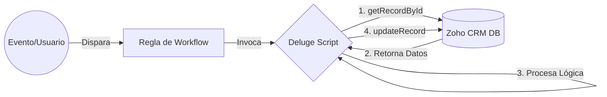
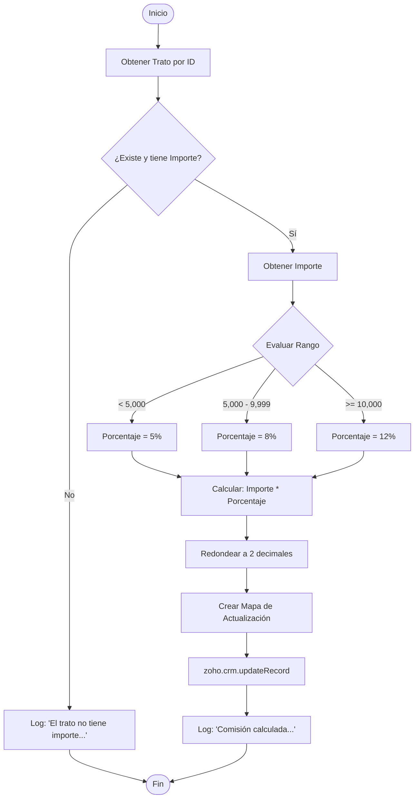

# Documentación Técnica: Script de Cálculo de Comisiones

## Arquitectura del Sistema
El siguiente diagrama ilustra el flujo de ejecución e interacción del script dentro del ecosistema de Zoho CRM.

## Información General
| Característica | Detalle |
| :--- | :--- |
| **Nombre del Archivo** | `comisiónEstimada` |
| **Plataforma** | Zoho CRM (Deluge Scripting) |
| **Tipo de Ejecución** | Backend (Server-side) |
| **Contexto Sugerido** | Workflow Rule en módulo **Deals** |

## Especificación de Entradas y Salidas

### Entradas (Inputs)
| Parámetro | Tipo de Dato | Descripción | Requerido |
| :--- | :--- | :--- | :--- |
| `id_trato` | `BigInt` / `Long` | ID único del registro en el módulo Deals. | Sí |

### Salidas (Outputs)
| Tipo | Descripción |
| :--- | :--- |
| **Retorno** | `void` (No retorna valor explícito). |
| **Efecto** | Actualiza el campo `Comisi_n_Estimada` en el registro. |
| **Logs** | `info` con el valor calculado o mensaje de error. |

## Estructura de Datos y Variables
| Variable | Tipo | Origen | Descripción |
| :--- | :--- | :--- | :--- |
| `trato` | `Record` | `zoho.crm.getRecordById` | Objeto completo del trato. |
| `importe` | `Decimal` | `trato.get("Amount")` | Valor base para el cálculo. |
| `porcentaje` | `Decimal` | Lógica condicional | Factor (0.05, 0.08, 0.12). |
| `comision_valor` | `Decimal` | Calculado | Resultado final (2 decimales). |
| `mapa_actualizar` | `Map` | Constructor | Payload para la API. |

## Algoritmo y Lógica
El script sigue una lógica condicional basada en el importe del trato para determinar el porcentaje de comisión.

## Manejo de Errores
| Condición | Acción del Script | Resultado |
| :--- | :--- | :--- |
| **ID Inválido** | Verificación `if(trato.get("id") != null)` | Mensaje en Log, no ejecuta cálculo. |
| **Importe Nulo** | Verificación `if(trato.get("Amount") != null)` | Mensaje en Log, no ejecuta cálculo. |
| **API Error** | Excepción interna de Zoho | Se registraría en los logs del sistema (no manejado explícitamente en código). |

## Dependencias del Esquema
| Módulo | Campo (API Name) | Tipo | Uso |
| :--- | :--- | :--- | :--- |
| **Deals** | `Amount` | Currency | Dato base para el cálculo. |
| **Deals** | `Comisi_n_Estimada` | Currency | Campo destino del resultado. |
